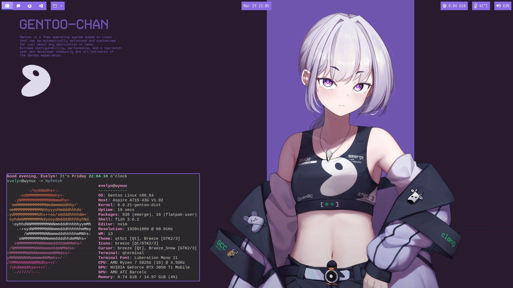

# Dotfiles~

My WM dotfiles, Right now using i3.

## Showcase


## NOTE:
The wallpaper can be found inside `i3/images`. ALL CREDIT GOES TO [Ravimo](https://www.pixiv.net/en/artworks/115453639).

You must use `nitrogen` for the wallpaper to show up.

## Usage

My WM config is based upon `stow` which will set symbolic links to your config directory.

You'll need all the apps I'm using, as well as `stow`.

```bash
git clone https://github.com/its-Lyn/dotfiles
cd dotfiles

chmod +x ./stow-invoke
./stow-invoke 
```

Stow invoke will first check `$XDG_CONFIG_HOME`, if that does not exist, it will use `~/.config`.

## Apps

### Terminal
Qterminal

### Styling choices 
- lxappearance
- qt5ct
- kvantum

### Misc
- PCManFM-qt
- pavucontrol-qt
- polybar
- rofi
- nitrogen
- picom

### REQUIRED FONTS
- Iosevka Nerd Font
- Agave Nerd Font Mono
